# Simple CTF — TryHackMe Writeup

**Platform:** TryHackMe  
**Room:** Simple CTF  
**Difficulty:** Easy  
**Points Earned:** 300  

---

## Overview

Simple CTF is a beginner-friendly machine on TryHackMe. The objective is to capture two flags — a user flag and a root flag. The attack chain covers web enumeration, exploiting a known SQL injection vulnerability in a CMS, cracking a password hash, and escalating privileges through a misconfigured sudo rule.

---

## 1. Enumeration

### Nmap Scan

Starting with a full Nmap scan to identify open ports and running services:

```bash
nmap -A 10.130.163.218
```

**Results:**

| Port | State | Service | Version |
|------|-------|---------|---------|
| 21/tcp | open | FTP | vsftpd 3.0.3 |
| 80/tcp | open | HTTP | Apache 2.4.18 (Ubuntu) |
| 2222/tcp | open | SSH | OpenSSH 7.2p2 |

Three interesting ports came up:
- **FTP (21)** — Anonymous login is enabled, worth investigating.
- **HTTP (80)** — A web server is up. The `robots.txt` file leaks a path: `/openemr-5_0_1_3`.
- **SSH (2222)** — Running on a non-standard port instead of the default 22.

---

### FTP — Anonymous Login

Since anonymous login is enabled, connecting to FTP requires no password:

```bash
ftp 10.130.163.218
# Username: anonymous
# Password: (leave blank)
```

Navigating to the `pub` folder reveals a file called `ForMitch.txt`.

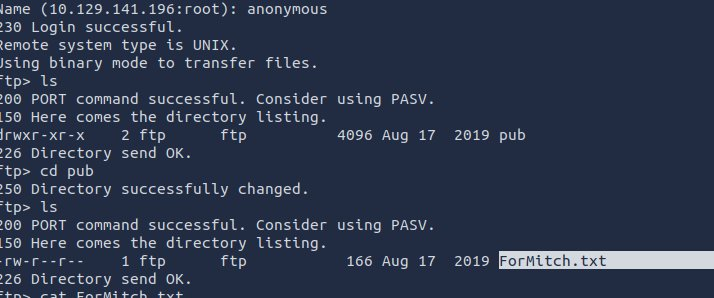

Reading the file:

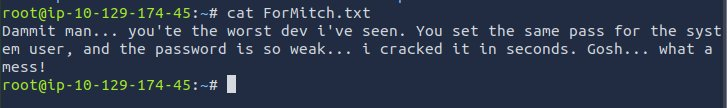

> *"Dammit man... you're the worst dev I've seen. You set the same password for the system user, and the password is so weak... I cracked it in seconds."*

This is a clear hint — the user **mitch** reuses a weak password across accounts. Worth keeping in mind.

---

### Web Server — Port 80

Visiting the web server shows the default Apache page, meaning no custom content is served at the root.

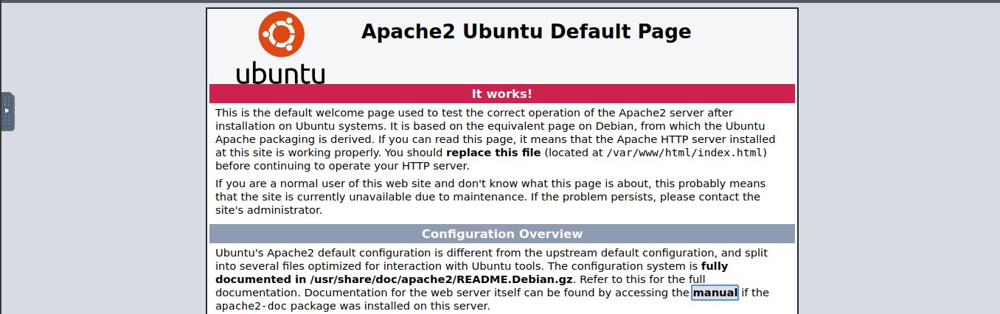

---

### Directory Enumeration with Gobuster

Running Gobuster to discover hidden directories:

```bash
gobuster dir -u http://10.130.163.218 -w /usr/share/wordlists/dirb/common.txt
```

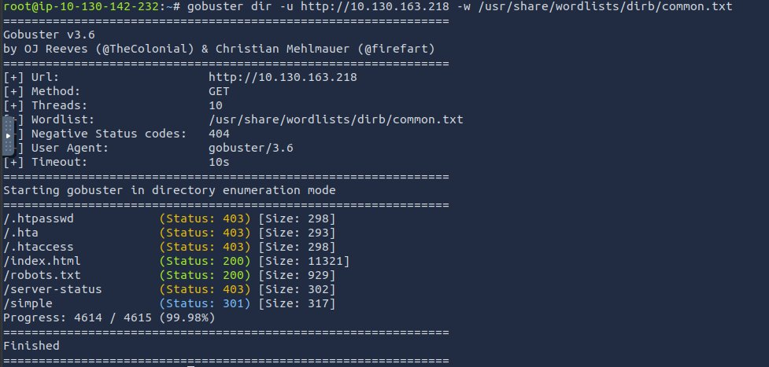

A directory called `/simple` shows up. Navigating to it reveals a **CMS Made Simple** installation running version **2.2.8**.

Running Gobuster again specifically on `/simple` to go deeper:

```bash
gobuster dir -u http://10.130.163.218/simple -w /usr/share/wordlists/dirb/common.txt
```

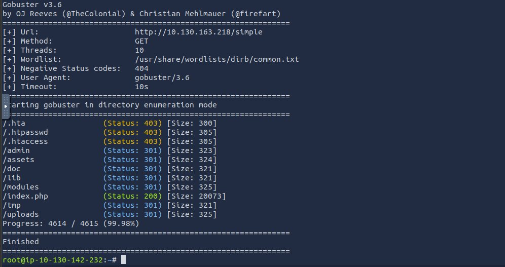

Several sub-directories are found: `/admin`, `/assets`, `/doc`, `/lib`, `/modules`, `/uploads`, and more.

---

## 2. The Exploit — CVE-2019-9053

### What the Vulnerability Is

Searching for known exploits against CMS Made Simple 2.2.8 quickly leads to **CVE-2019-9053** — a **time-based blind SQL injection** vulnerability affecting all versions below 2.2.10. It allows an unauthenticated attacker to extract credentials from the database by measuring server response times.

Exploit reference: [https://www.exploit-db.com/exploits/46635](https://www.exploit-db.com/exploits/46635)

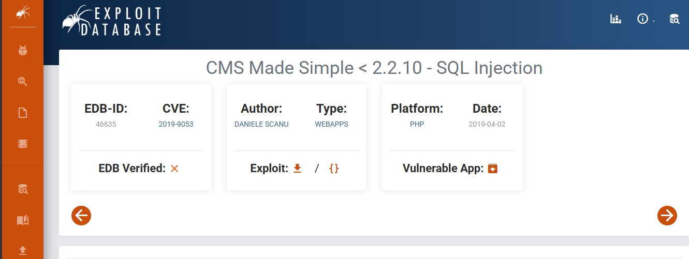

### How the Script Works

Before running anything, here's a breakdown of the key parts of the exploit code:

**Imports:**
```python
import requests       # Sends HTTP GET/POST requests to the target
from termcolor import colored  # Prints colored output in the terminal
import time           # Measures response time (core of the timing attack)
import optparse       # Parses command-line arguments like -u, -w, -c
import hashlib        # Computes MD5 hashes for password cracking
```

**Argument parsing:**
```python
parser = optparse.OptionParser()
parser.add_option('-u', '--url', ...)      # Target URL
parser.add_option('-w', '--wordlist', ...) # Path to a password wordlist
parser.add_option('-c', '--crack', ...)    # Flag: crack the hash or not?
options, args = parser.parse_args()
```

The script injects SQL payloads and measures how long each response takes. Based on those delays, it reconstructs the username, email, password hash, and salt — character by character. This technique is called a **time-based blind SQL injection**.

---

## 3. Running the Exploit

Download the exploit with `searchsploit`:

```bash
searchsploit -m 46635
```

> **Note:** The script was originally written in Python 2. Update it to Python 3 before running.

Once updated, run it against the target:

```bash
python3 exploit.py -u http://10.129.141.196/simple
```

The script successfully extracts the credentials:

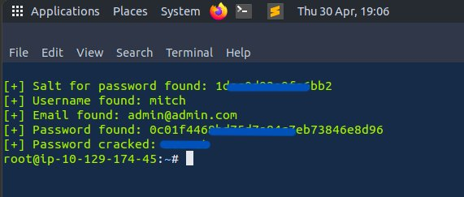

- **Username:** `mitch`
- **Email:** `admin@admin.com`
- **Password hash:** MD5 + salt
- **Cracked password:** *(blurred in screenshot)*

The hash is cracked using **CyberChef**. The password is weak — exactly as the FTP note warned.

---

## 4. SSH Access

With valid credentials in hand, logging in via SSH is straightforward. Note that SSH is on **port 2222**:

```bash
ssh mitch@10.129.141.196 -p 2222
```

A quick look at `/home` shows two users on the machine: **mitch** and **sunbath**.

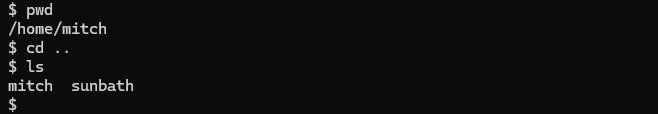

---

## 5. User Flag

The user flag is sitting in mitch's home directory:

```bash
cat user.txt
```

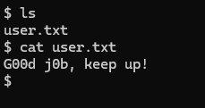

> **User flag:** `G00d j0b, keep up!`

---

## 6. Privilege Escalation

### Checking Sudo Rights

Checking what mitch is allowed to run as root:

```bash
sudo -l
```

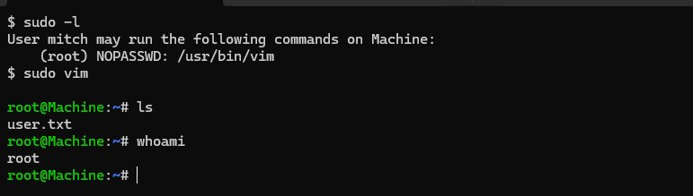

```
(root) NOPASSWD: /usr/bin/vim
```

`vim` can be run as root without a password — a classic misconfiguration.

### Escaping to Root via Vim

Launching vim with sudo and using its built-in shell escape:

```bash
sudo vim
```

Inside vim, type:
```
:!/bin/bash
```

This spawns a root shell. Confirmed with `whoami` — output is `root`.

---

## 7. Root Flag

From the root shell, navigating to `/root` and reading the flag:

```bash
cd /root
cat root.txt
```

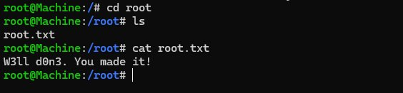

> **Root flag:** `W3ll d0n3. You made it!`

---

## 8. Complete

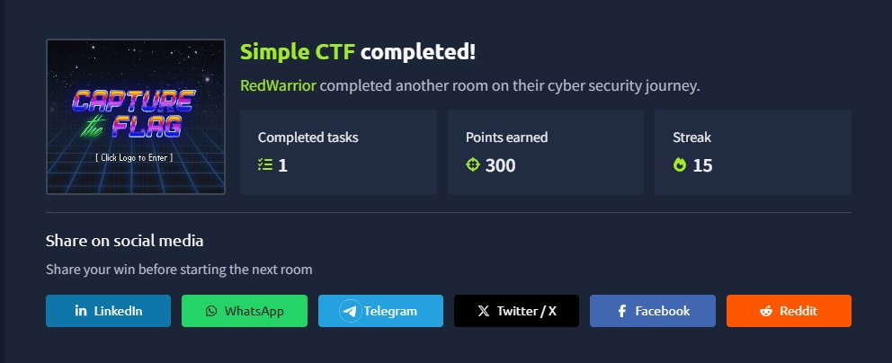

**300 points. Room complete.**

---

## Attack Summary

| Step | Action |
|------|--------|
| Nmap | Discovered FTP (21), HTTP (80), SSH (2222) |
| FTP | Anonymous login — found hint about weak password for `mitch` |
| Gobuster | Found `/simple` running CMS Made Simple 2.2.8 |
| CVE-2019-9053 | Blind SQL injection to extract database credentials |
| Hash cracking | Cracked MD5 hash with CyberChef |
| SSH | Logged in as `mitch` on port 2222 |
| User flag | Found in `/home/mitch/user.txt` |
| Privesc | `sudo vim` → shell escape → root |
| Root flag | Found in `/root/root.txt` |

---

## Tools Used

| Tool | Purpose |
|------|---------|
| `nmap` | Port and service scanning |
| `gobuster` | Directory enumeration |
| `ftp` | Anonymous file access |
| `searchsploit` | Finding public exploits |
| Python 3 | Running the SQLi exploit |
| CyberChef | Cracking the password hash |
| `ssh` | Remote login |
| `vim` | Privilege escalation |
